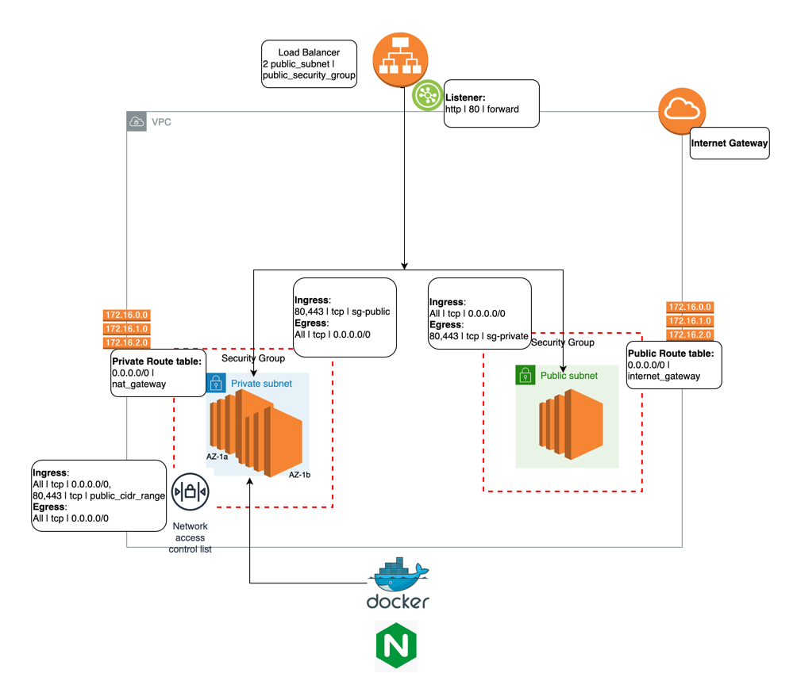

# KNAB Assessment
As per the assignment we have created networking according to below architecture with a docker container running on the EC2 linux instance which will refer the Nginx docker image from docker registry.

This projects creates 24 resources in AWS using terraform. It uses nginx image and runs 
in the linux machine.
This can be easily verified with the below steps mentioned.

# Architecture diagram 



## Description
We will describe the architecture diagram as below:

- **Virtual Private Cloud(VPC)**:We are deploying a custom vpc here with address range 10.0.0.0/16 with public and private subnets within the vpc.
    More details about the VPC can be read [here](https://docs.aws.amazon.com/vpc/latest/userguide/what-is-amazon-vpc.html).

- **Internet Gateway**: In order to get the access to our nginx web server from the private subnet we need to enable the internet connectivity for which we need internet gateway which is then attached to the VPC.
    This internet gateway is also added as a route to public subnets.

- **Subnets**: We have deployed two counts of both public and private subnets. Application Load balancer needs atleast two public subnets to function and so
    we have deployed two private subnets where our linux instances will reside so that the load is balanced well by the load balancer within these instances deployed in two different availability zones.

- **NAT gateway**: In order to secure our private instances we have denied outside access but in order to download 
    the image from public docker hub registry we need to egress outside connectivity from the instance
    subnet so that we can download the upgrades as well as docker images for installation. This NAT gateway is added
    as a route to private subnets. Get to know how NAT gateway works then [visit](https://docs.aws.amazon.com/vpc/latest/userguide/vpc-nat-gateway.html).

- **Route Table and its association**: We have deployed two route table along with its association done with public and private subnet.

# How to use

The infrastructure(VPC,subnets,Route table, Route table association, Network access control list, security groups both for private and public), docker installation and docker run for nginx container
are all consolidated within a bash script for an ease to work. The bash script also creates the module usage doc 
using [terraform docs](https://github.com/terraform-docs/terraform-docs).

The run is customised platform where you can run the bash script.

Below are the steps for the same:

### Pre-requisites
- Linux or MacOS laptop.
- Docker daemon should be running 
- Terraform Cli `v 1.3.3` installed. You can follow the [link](https://learn.hashicorp.com/tutorials/terraform/install-cli)
- Update your AWS credentials in `.aws/credentials` file
```
vim ~/.aws/credentials
``` 

### Step 1: 
```
git clone jjjjjjjj
```
Cloning the project from Github.

### Step 2:
Go to the cloned repository.
```
cd knab-assignment/
```

### Step 3:
By default all variables are set in `variables.tf` file in the root of the directory. Kindly update as per the requirement.
You can scroll down for module usage in the Release Notes.

### Step 4:
Run the shell script for creating the infrastructure as described in the architecture diagram.

Change the script permission if required:
```
chmod 700 infra.sh
# Run the script from the root directory of the repo
./infra.sh
```

Within the script when `terraform apply` is run then manually provide the consent as `yes` to apply the changes.

You can also perform the deployment using manual steps:
```
terrform init
terraform plan
terraform apply --auto-approve #Auto Approve to apply the changes
```
### Step 5: 
Copy the value of output `alb_url` which can be used to hit the web server.

### Step 6:
Deleting the infrastructure once done.
```
terraform init
terraform plan
terraform destroy --auto-approve
```


